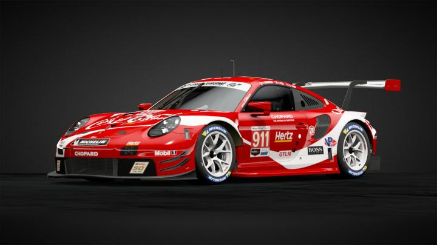
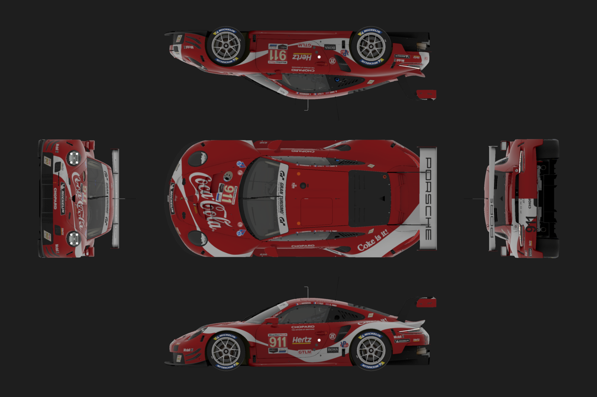

## Livery

Base URL: `https://s3.amazonaws.com/gt7sp-prod/livery/XX/XX/XX/XX...XX_`

This endpoint is different from the others listed within this repo since rather than taking parameters it is a simple access point for retrieving image assets. 

The back half of the URL will contain a series of numbers indicated here by X's. These numbers remain static, and are not important for different image retrieval. To get the correct base URL values for the livery you are concerned with you will need to gather that manually from the [Community](https://www.gran-turismo.com/us/gtsport/user/discover/search/carLivery/livery/2937223/1/8575500274217550897) site by opening the full screen view of a livery preview. Then use everything in the URL up to and including the `_` for subsequent requests.

### Parameters

All of the various image assets related to the livery are accessible through different numbers and extensions appended to the base URL after the `_`. 

The available options include:

* `23.jpg` = Full size front profile view

* `22.jpg` = Same as 12 but larger

* `21.jpg` = Same as 13 but smaller

* `11.jpg` = Thumbnail front profile view

* `12.jpg` = Thumbnail front profile view (taller aspect ratio)

* `13.jpg` = Thumbnail front profile view (larger size)

* `1.png`  = Multi-profile livery views without depth

